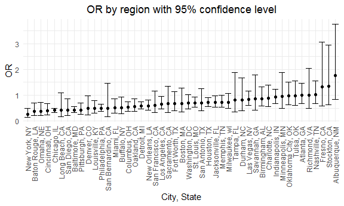
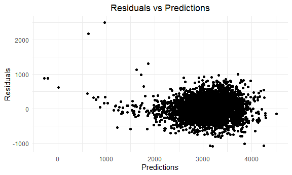
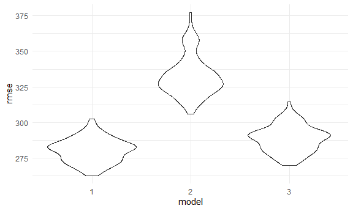
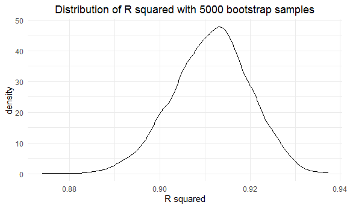
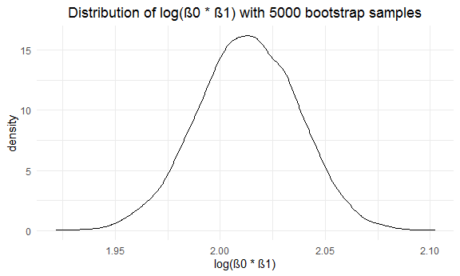

p8105\_hw6\_wc2750
================
Weixi Chen
12/8/2020

## Problem 1

``` r
homicide_df = 
  read_csv("data/homicide-data.csv") %>%
  mutate(
    city_state = str_c(city, state, sep = ", "),
    resolution = case_when(
      disposition == "Closed without arrest" ~ 0,
      disposition == "Open/No arrest"        ~ 0,
      disposition == "Closed by arrest"      ~ 1
    ),
    victim_age = as.numeric(victim_age)
  ) %>%
  filter(victim_race %in% c("White", "Black"),
         city_state != "Tulsa, AL") %>%
  select(city_state, resolution, victim_age, victim_race, victim_sex)
```

Start with one city

``` r
baltimore_df =
  homicide_df %>%
  filter(city_state == "Baltimore, MD")

glm(resolution ~ victim_age + victim_race + victim_sex, data = baltimore_df,
    family = binomial()) %>%
  broom::tidy() %>%
  mutate(
    OR = exp(estimate),
    CI_lower = exp(estimate - 1.96 * std.error),
    CI_upper = exp(estimate + 1.96 * std.error)
  ) %>%
  select(term, OR, starts_with("CI")) %>%
  knitr::kable(digits = 3)
```

| term              |    OR | CI\_lower | CI\_upper |
| :---------------- | ----: | --------: | --------: |
| (Intercept)       | 1.363 |     0.975 |     1.907 |
| victim\_age       | 0.993 |     0.987 |     1.000 |
| victim\_raceWhite | 2.320 |     1.648 |     3.268 |
| victim\_sexMale   | 0.426 |     0.325 |     0.558 |

Try this across cities

``` r
models_results_df = 
  homicide_df %>%
  nest(data = -city_state) %>%
  mutate(
    models = 
      map(.x = data, ~glm(resolution ~ victim_age + victim_race + victim_sex, data = .x, family = binomial())),
    results = map(models, broom::tidy)
  ) %>%
  select(city_state, results) %>%
  unnest(results) %>%
  mutate(
    OR = exp(estimate),
    CI_lower = exp(estimate - 1.96 * std.error),
    CI_upper = exp(estimate + 1.96 * std.error)
  ) %>%
  select(city_state, term, OR, starts_with("CI"))
```

``` r
models_results_df %>%
  filter(term == "victim_sexMale") %>%
  mutate(city_state = fct_reorder(city_state, OR)) %>%
  ggplot(aes(x = city_state, y = OR)) +
  geom_point() +
  geom_errorbar(aes(ymin = CI_lower, ymax = CI_upper)) +
  labs(x = "City, State" , title = "OR by region with 95% confidence level") +
  theme(axis.text.x = element_text(angle = 90, vjust = 0.5, hjust = 1))
```



## Problem 2

Load and clean child’s birthweight data

``` r
baby_df = 
  read_csv("data/birthweight.csv") %>%
  mutate(babysex = as.factor(babysex),
         frace = as.factor(frace),
         malform = as.factor(malform),
         mrace = as.factor(mrace)) %>%
  mutate(mrace = case_when(mrace == 1 ~ "White",
                           mrace == 2 ~ "Black",
                           mrace == 3 ~ "Asian",
                           mrace == 4 ~ "Puerto Rican",
                           mrace == 8 ~ "Other"),
         babysex = case_when(babysex == 1 ~ "male",
                             babysex == 2 ~ "female"),
         frace = case_when(frace == 1 ~ "White",
                           frace == 2 ~ "Black",
                           frace == 3 ~ "Asian",
                           frace == 4 ~ "Puerto Rican",
                           frace == 8 ~ "Other",
                           frace == 9 ~ "Unknown"),
         malform = case_when(malform == 0 ~ "absent",
                             malform == 1 ~ "present")
         ) %>%
  drop_na()
```

Propose a regression model for birthweight through stepwise

``` r
reg_all = lm(bwt ~ ., data = baby_df)
step(reg_all, direction='both')

reg_step = lm(bwt ~ babysex + bhead + blength + delwt + fincome + 
    gaweeks + mheight + mrace + parity + ppwt + smoken, data = baby_df)

reg_step %>%
  broom::tidy() %>% 
  select(term, estimate, p.value) %>%
  knitr::kable(digits = 3)
```

``` r
reg_1 = lm(bwt ~ babysex + bhead + blength + delwt + gaweeks + mheight + parity + ppwt + smoken, data = baby_df)

summary(reg_1)
```

    ## 
    ## Call:
    ## lm(formula = bwt ~ babysex + bhead + blength + delwt + gaweeks + 
    ##     mheight + parity + ppwt + smoken, data = baby_df)
    ## 
    ## Residuals:
    ##      Min       1Q   Median       3Q      Max 
    ## -1090.67  -180.43    -6.83   176.33  2495.11 
    ## 
    ## Coefficients:
    ##               Estimate Std. Error t value Pr(>|t|)    
    ## (Intercept) -6687.5367   134.0710 -49.881  < 2e-16 ***
    ## babysexmale   -29.3662     8.6833  -3.382 0.000726 ***
    ## bhead         136.4950     3.5146  38.837  < 2e-16 ***
    ## blength        77.5095     2.0673  37.493  < 2e-16 ***
    ## delwt           3.7003     0.4020   9.205  < 2e-16 ***
    ## gaweeks        13.8986     1.4956   9.293  < 2e-16 ***
    ## mheight         9.5975     1.7875   5.369 8.32e-08 ***
    ## parity         99.1233    41.4750   2.390 0.016893 *  
    ## ppwt           -2.5806     0.4390  -5.879 4.45e-09 ***
    ## smoken         -2.3756     0.5794  -4.100 4.20e-05 ***
    ## ---
    ## Signif. codes:  0 '***' 0.001 '**' 0.01 '*' 0.05 '.' 0.1 ' ' 1
    ## 
    ## Residual standard error: 280.1 on 4332 degrees of freedom
    ## Multiple R-squared:  0.7015, Adjusted R-squared:  0.7009 
    ## F-statistic:  1131 on 9 and 4332 DF,  p-value: < 2.2e-16

My hypothesized model, based on stepwise modeling selection and
significant p-values smaller than 0.05, includes predictors: babysex,
bhead, blength, delwt, gaweeks, mheight, parity, ppwt, and smoken. The
adjusted R-squared is 0.70, indicating that a high persentage of
variations in the birthweight can be explained by these predictors.

Plot of model residuals against fitted values

``` r
baby_df %>%
  add_residuals(reg_1) %>%
  add_predictions(reg_1) %>%
  ggplot(aes(x = pred, y = resid)) +
  geom_point() +
  labs(x = "Predictions", y = "Residuals", title = "Residuals vs Predictions")
```



Based on this model diagnosis plot, we can see that majority of
predictions are centered around residuals 0, though there is few
outliers with low prediction and high residual, scattering on the
upper-left corner of the plot.

Compare my model to two others through cross-validation:  
\* One using length at birth and gestational age as predictors (main
effects only)  
\* One using head circumference, length, sex, and all interactions
(including the three-way interaction) between these

``` r
reg_2 = lm(bwt ~ blength + gaweeks, data = baby_df)

reg_2 %>%
  broom::tidy() %>% 
  select(term, estimate, p.value) %>%
  knitr::kable(digits = 3)
```

| term        |   estimate | p.value |
| :---------- | ---------: | ------: |
| (Intercept) | \-4347.667 |       0 |
| blength     |    128.556 |       0 |
| gaweeks     |     27.047 |       0 |

``` r
reg_3 = lm(bwt ~ bhead * blength * babysex, data = baby_df)

reg_3 %>%
  broom::tidy() %>% 
  select(term, estimate, p.value) %>%
  knitr::kable(digits = 3)
```

| term                      |   estimate | p.value |
| :------------------------ | ---------: | ------: |
| (Intercept)               |  \-801.949 |   0.467 |
| bhead                     |   \-16.598 |   0.626 |
| blength                   |   \-21.646 |   0.354 |
| babysexmale               | \-6374.868 |   0.000 |
| bhead:blength             |      3.324 |   0.000 |
| bhead:babysexmale         |    198.393 |   0.000 |
| blength:babysexmale       |    123.773 |   0.000 |
| bhead:blength:babysexmale |    \-3.878 |   0.000 |

``` r
set.seed(1)
cv_df = 
  crossv_mc(baby_df, 100) %>% 
   mutate(
        train = map(train, as_tibble),
        test = map(test, as_tibble)
    )

cv_df = 
  cv_df %>% 
  mutate(
    model_1  = map(train, ~lm(bwt ~ babysex + bhead + blength + delwt + gaweeks + mheight + parity + ppwt + smoken, data = .x)),
    model_2  = map(train, ~lm(bwt ~ blength + gaweeks, data = .x)),
    model_3  = map(train, ~lm(bwt ~ bhead + blength + babysex + bhead * blength + bhead * babysex + blength * babysex + bhead * blength * babysex, data = .x))) %>% 
  mutate(
    rmse_1 = map2_dbl(model_1, test, ~rmse(model = .x, data = .y)),
    rmse_2 = map2_dbl(model_2, test, ~rmse(model = .x, data = .y)),
    rmse_3 = map2_dbl(model_3, test, ~rmse(model = .x, data = .y)))

cv_df %>% 
  select(starts_with("rmse")) %>% 
  pivot_longer(
    everything(),
    names_to = "model", 
    values_to = "rmse",
    names_prefix = "rmse_") %>% 
  mutate(model = fct_inorder(model)) %>% 
  ggplot(aes(x = model, y = rmse)) + geom_violin()
```



Based on the cross-validation by comparing rmse value, my proposed model
has the lowest rmse, indictaing it is best model among these three
models. Model 3 is also a good choice since it has relatively smaller
number of predictors and also a small rmse.

## Problem 3

Load weather data

``` r
weather_df = 
  rnoaa::meteo_pull_monitors(
    c("USW00094728"),
    var = c("PRCP", "TMIN", "TMAX"), 
    date_min = "2017-01-01",
    date_max = "2017-12-31") %>%
  mutate(
    name = recode(id, USW00094728 = "CentralPark_NY"),
    tmin = tmin / 10,
    tmax = tmax / 10) %>%
  select(name, id, everything())
```

Bootstrap 5000 samples with results in estimates and R squared

``` r
set.seed(1)

bootstrap_df = 
  weather_df %>%
  bootstrap(n = 5000) %>% 
  mutate(
    models = map(strap, ~ lm(tmax ~ tmin, data = .x)),
    results_1 = map(models, broom::glance),
    results_2 = map(models, broom::tidy)) %>%
  select(results_1, results_2) %>%
  unnest(c(results_1, results_2), names_repair = "minimal") %>%
  select(term, estimate, r.squared) %>%
  mutate(term = case_when(term == "(Intercept)" ~ "intercept",
                          term == "tmin" ~ "tmin")) %>%
  pivot_wider(names_from = term,
              values_from = estimate) %>%
  unnest(c(intercept, tmin)) %>%
  mutate(log = log(intercept * tmin))

bootstrap_df
```

    ## # A tibble: 5,000 x 4
    ##    r.squared intercept  tmin   log
    ##        <dbl>     <dbl> <dbl> <dbl>
    ##  1     0.907      7.45 1.03   2.04
    ##  2     0.896      7.36 1.03   2.03
    ##  3     0.918      7.48 1.04   2.05
    ##  4     0.899      7.91 0.998  2.07
    ##  5     0.913      6.73 1.07   1.97
    ##  6     0.919      6.87 1.06   1.99
    ##  7     0.918      7.11 1.03   2.00
    ##  8     0.907      7.14 1.03   2.00
    ##  9     0.916      7.10 1.05   2.01
    ## 10     0.918      7.18 1.05   2.02
    ## # ... with 4,990 more rows

Plot the distribution of R squared and log(β0 \* β1)

``` r
bootstrap_df %>%
  ggplot(aes(x = r.squared)) + geom_density() +
  labs(x = "R squared", title = "Distribution of R squared with 5000 bootstrap samples")
```



``` r
bootstrap_df %>%
  ggplot(aes(x = log)) + geom_density() +
  labs(x = "log(β0 * β1)", title = "Distribution of log(β0 * β1) with 5000 bootstrap samples")
```



The shape of the distribution of R squared looks like normal but it has
skewness to the left. The mean of R squared is higher than 90%,
indicating a high variations in the outcome - tmax can be explained by
the predictor - tmin. The distribution of log(β0 \* β1) is very close to
normal, and the mean is around 2.01.

Identify the 2.5% and 97.5% quantiles to provide a 95% confidence
interval for R squared and log(β0 \* β1)

``` r
bootstrap_df %>%
  summarize(percentile = scales::percent(c(0.025, 0.975), accuracy = 0.1),
            conf_rsquared = quantile(r.squared, probs = c(0.025, 0.975)),
            conf_log = quantile(log, probs = c(0.025, 0.975))) %>%
  knitr::kable()
```

| percentile | conf\_rsquared | conf\_log |
| :--------- | -------------: | --------: |
| 2.5%       |      0.8936684 |  1.964949 |
| 97.5%      |      0.9271060 |  2.058887 |
